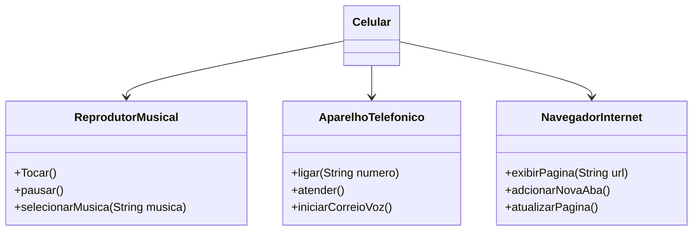

# Criando_um_Celular

## Diagrama em URL

```mermaid
classDiagram
    class ReprodutorMusical {
        +Tocar( )
        +pausar( )
        +selecionarMusica(String musica)
    }

    class AparelhoTelefonico {
        +ligar(String numero)
        +atender ( )
        +iniciarCorreioVoz( )
    }

    class NavegadorInternet {
      +exibirPagina(String url)
      +adcionarNovaAba( )
      +atualizarPagina( )
    }

    class Celular {
    }

    Celular --> ReprodutorMusical
    Celular --> AparelhoTelefonico
    Celular --> NavegadorInternet
```
