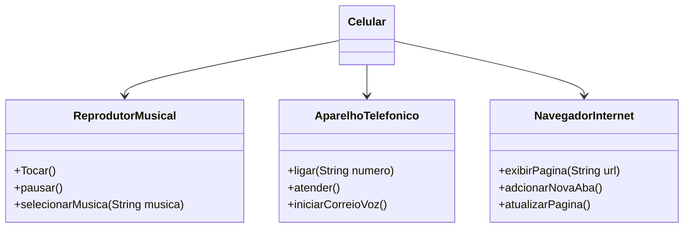

# Criando_um_Celular

link do URL: https://www.mermaidchart.com/raw/446c3d60-08f6-4217-baa2-620a24481b89?theme=light&version=v0.1&format=svg

## Diagrama em URL

```mermaid
classDiagram
    class ReprodutorMusical {
        +Tocar( )
        +pausar( )
        +selecionarMusica(String musica)
    }

    class AparelhoTelefonico {
        +ligar(String numero)
        +atender ( )
        +iniciarCorreioVoz( )
    }

    class NavegadorInternet {
      +exibirPagina(String url)
      +adcionarNovaAba( )
      +atualizarPagina( )
    }

    class Celular {
    }

    Celular --> ReprodutorMusical
    Celular --> AparelhoTelefonico
    Celular --> NavegadorInternet
```
